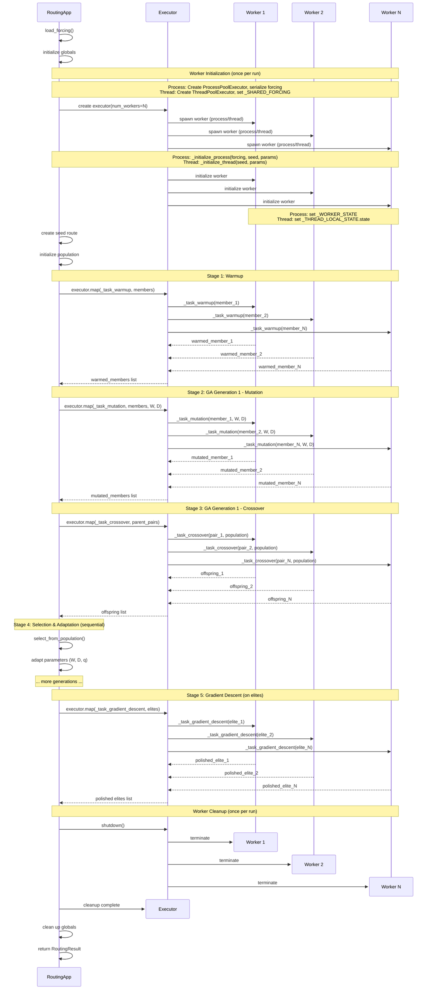

# Ship Routing Module Architecture

## Algorithm Flow

The following flowchart visualizes the complete optimization algorithm as implemented in `RoutingApp.run()`.

```mermaid
flowchart LR
    Start([Start]) --> LoadForcing[Load forcing data<br/>currents, winds, waves]

    LoadForcing --> Init

    subgraph Init["Stage 1: Initialization"]
        CreateSeed[Create seed route r_seed<br/>great circle, uniform speed]
        CreateSeed --> InitPop[Initialize population P<br/>M copies of r_seed]
    end

    Init --> Warmup

    subgraph Warmup["Stage 2: Warmup"]
        MutateWarmup[Mutate M-1 members<br/>M_Ww,Dw]
        MutateWarmup --> SelectWarmup[Select with S_2^pw]
        SelectWarmup --> PreserveSeed1[Preserve seed<br/>P <- P U r_seed]
    end

    Warmup --> InitParams[Initialize adaptive params<br/>W, D, q]

    InitParams --> GALoop

    subgraph GALoop["Stage 3: Genetic Evolution"]
        LoopStart{g < N_G?}
        LoopStart -->|Yes| GAMutation

        subgraph GAIteration["Generation g"]
            GAMutation[Mutation: M-1 members<br/>M_W,D + S_2^p]
            GAMutation --> PreserveSeed2[Preserve seed<br/>P <- P U r_seed]
            PreserveSeed2 --> GACrossover[Crossover: Create P_offspring<br/>M_offspring via C_s]
            GACrossover --> AddSeed[Add seed to offspring<br/>P_offspring <- P_offspring U r_seed]
            AddSeed --> GASelection[Selection: S_M,q,M-1<br/>select M-1 best]
            GASelection --> PreserveSeed3[Preserve seed<br/>P <- P U r_seed]
            PreserveSeed3 --> GAAdaptation[Adapt parameters<br/>W, D, q]
        end

        GAAdaptation --> LoopStart
    end

    LoopStart -->|No| PostProc

    subgraph PostProc["Stage 4: Post-processing"]
        PostLoop{n < N_gd?}
        PostLoop -->|Yes| SelectElites

        subgraph GDIteration["Gradient Descent n"]
            SelectElites[Select k elites<br/>S_M,k/M,M-1]
            SelectElites --> PreserveSeed4[Preserve seed<br/>P <- P U r_seed]
            PreserveSeed4 --> ApplyGD[Apply gradient descent<br/>G_t^gamma_t o G_perp^gamma_perp to each elite]
        end

        ApplyGD --> PostLoop
    end

    PostLoop -->|No| Return[Return RoutingResult<br/>seed_member, elite_population, logs]
    Return --> End([End])
```

## Execution Sequence

The routing application supports three execution modes: **multiprocessing**, **multithreading**, and **sequential**. The mode is controlled by `HyperParams.executor_type` and `HyperParams.num_workers`.

### Parallel Execution

The following sequence diagram shows a typical `RoutingApp.run()` execution with parallel execution enabled (`executor_type="process"` or `"thread"`):

### Worker Lifecycle Notes

**Single Worker Pool Per Run:**
- Workers are created ONCE at the start of `RoutingApp.run()` (if parallelization enabled)
- The same worker pool is reused across ALL parallelized stages
- Workers are destroyed ONCE at the end via `finally` block
- This eliminates the overhead of repeated process/thread creation/destruction

**Execution Modes:**
- **Process** (`executor_type="process"`): Uses `ProcessPoolExecutor`
  - Each worker is a separate process with isolated memory
  - Forcing data serialized and passed to each worker at initialization
  - Best for CPU-bound workloads with minimal data transfer
  - Overhead: ~3s startup with 8 workers, but avoids Python GIL
- **Thread** (`executor_type="thread"`): Uses `ThreadPoolExecutor`
  - Workers are threads sharing the main process memory
  - Forcing data shared via `_SHARED_FORCING` module-level global (no serialization)
  - Best for NumPy-heavy workloads where operations release GIL
  - Lower overhead than processes, but subject to GIL for pure Python code
- **Sequential** (`executor_type="sequential"`): No executor, inline processing
  - All tasks executed sequentially in main thread
  - Zero parallelization overhead, useful for debugging and baseline benchmarks
  - Worker state initialized inline before each stage

**Performance Impact:**
- Previous implementation: Workers created/destroyed for each stage
  - With 2 generations: 1 warmup + 2 mutations + 2 crossovers = 5 pool creations
  - Overhead: ~15s for 5 pools × ~3s each with 8 workers
  - Result: Negative speedup (0.51x with 8 workers)
- Current implementation: Single worker pool
  - One-time creation overhead: ~3s with 8 workers (process mode)
  - Observed speedup: 1.33x with 4 process workers on test workload
  - Threading overhead: Lower startup cost but limited by GIL for this workload

**Sequential vs Parallel Stages:**
- **Parallelized stages** (use workers when enabled): Warmup, mutation, crossover, gradient descent
- **Always sequential stages** (main process only): Initialization, selection, adaptation

**Worker State Management:**
- **Process workers**: Each maintains separate `_WORKER_STATE` global in its memory space
  - Forcing data is passed at initialization to avoid repeated serialization
  - RNG seeds unique per worker (based on main RNG seed)
- **Thread workers**: Each maintains thread-local state via `_THREAD_LOCAL_STATE`
  - Forcing data accessed from shared `_SHARED_FORCING` (no serialization needed)
  - RNG seeds unique per thread (seed + thread ID for uniqueness)
- **Sequential mode**: Uses `_WORKER_STATE` in main thread, re-initialized before each stage

### Key Operations

- `Mutation` ($M_{W,D}$): Stochastic perturbation moving waypoints perpendicular to route
- `Selection from pair` ($S_2^p$): Probabilistic acceptance comparing two routes
- `Selection from population` ($S_{M,q,k}$): Quantile-based selection keeping top performers
- `Crossover` ($C_s$): Recombination of two parent routes at intersection points
- `Gradient Descent` ($G_t^{\gamma_t} \circ G_\perp^{\gamma_\perp}$): Local optimization in time and space dimensions

## Data Flow Example

A typical routing optimization run follows this flow:

1. **_Initialize_**: `RoutingApp` loads `RoutingConfig` and forcing data using `DataModule` functions

2. **_Seed Population_**: Create initial population with a greedy or random route

3. **_Optimization Loop_**:
   - Mutation: Perturb routes to create variants
   - Crossover: Combine high-performing routes
   - Selection: Keep elite members based on cost
   - Gradient Descent: Local refinement on top performers

4. **_Cost Calculation_**: For each route evaluation:
   - Decompose `Route` into `Leg`s
   - Select forcing data for each `Leg` (`DataModule`)
   - Calculate power required (`CostModule`) using `Ship`/`Physics` parameters
   - Aggregate costs across `Leg`s

5. **_Return Results_**: `RoutingResult` with best route, elite population, and detailed logs

## Architecture

The `ship_routing` module implements a route optimization system using a three-layer architecture:

- **APP Layer**: Orchestration of the optimization pipeline and configuration management
- **ALGORITHMS Layer**: Pure functional operators for algorithm building
- **CORE Layer**: Immutable data structures, physics calculations, and environmental data handling

### Architecture Diagram

```mermaid
classDiagram
    direction LR
    %%% ============================================
    %%% APP LAYER: Orchestration & Configuration
    %%% ============================================

    class RoutingApp {
        -config: RoutingConfig
        -forcing_data: ForcingData
        +run() RoutingResult
    }

    class RoutingResult {
        -seed_member: PopulationMember
        -elite_population: Population
        -logs: RoutingLog
        +to_dict() dict
        +to_msgpack() bytes
    }

    class RoutingConfig {
        -journey: JourneyConfig
        -forcing: ForcingConfig
        -ship: Ship
        -physics: Physics
        -hyper: HyperParams
    }

    class JourneyConfig {
        -lon_waypoints: Tuple[float]
        -lat_waypoints: Tuple[float]
        -time_start: str
        -time_end: str
        -speed_knots: float
        -time_resolution_hours: float
    }

    class ForcingConfig {
        -currents_path: str
        -waves_path: str
        -winds_path: str
        -engine: str
        -chunks: str
        -load_eagerly: bool
        -enable_spatial_cropping: bool
        -route_length_multiplier: float
        -spatial_buffer_degrees: float
    }

    class ForcingData {
        -currents: HashableDataset
        -waves: HashableDataset
        -winds: HashableDataset
    }

    class HyperParams {
        -population_size: int
        -random_seed: int
        -generations: int
        -selection_quantile: float
        -selection_acceptance_rate_warmup: float
        -selection_acceptance_rate: float
        -mutation_width_fraction: float
        -mutation_displacement_fraction: float
        -mutation_iterations: int
        -crossover_strategy: Literal
        -crossover_rounds: int
        -hazards_enabled: bool
        -num_elites: int
        -gd_iterations: int
        -learning_rate_time: float
        -learning_rate_space: float
        -time_increment: float
        -distance_increment: float
        -num_workers: int
        -executor_type: Literal
    }

    class RoutingLog {
        -config: dict
        -stages: list[StageLog]
        +add_stage() void
        +to_dataframe() DataFrame
    }

    class StageLog {
        -name: str
        -metrics: dict
        -timestamp: str
    }

    %%% ================================================
    %%% ALGORITHMS LAYER: Optimization Operations
    %%% ================================================

    class Mutation {
        <<module>>
        +stochastic_mutation(Route) Route
    }

    class Crossover {
        <<module>>
        +crossover_routes_random() Route
        +crossover_routes_minimal_cost() Route
    }

    class Selection {
        <<module>>
        +select_from_population() PopulationMember
        +select_from_pair() PopulationMember
    }

    class GradientDescent {
        <<module>>
        +gradient_descent() Route
        +gradient_descent_time_shift() Route
        +gradient_descent_along_track() Route
    }

    %%% ==================================================
    %%% CORE LAYER: Data Structures & Physics
    %%% ==================================================

    class WayPoint {
        -lon: float
        -lat: float
        -time: datetime64
        +move_space() WayPoint
        +move_time() WayPoint
        +point: Point
    }

    class Leg {
        -way_point_start: WayPoint
        -way_point_end: WayPoint
        +cost_through() float
        +hazard_through() bool
        +refine() Leg
        +azimuth_degrees: float
    }

    class Route {
        -way_points: Tuple[WayPoint]
        +cost_through() float
        +cost_gradient_along_track() ndarray
        +cost_gradient_across_track_left() ndarray
        +cost_gradient_time_shift() ndarray
        +legs: list[Leg]
    }

    class PopulationMember {
        -route: Route
        -cost: float
        +cost_valid: bool
        +to_dict() dict
        +from_dict() PopulationMember
    }

    class Population {
        -members: list[PopulationMember]
        +add_member() Population
        +sort() Population
        +remove_invalid() void
        +size: int
    }

    class Ship {
        -waterline_width_m: float
        -waterline_length_m: float
        -total_propulsive_efficiency: float
        -reference_engine_power_W: float
        -reference_speed_calm_water_ms: float
        -draught_m: float
        -projected_frontal_area_above_waterline_m2: float
        -wind_resistance_coefficient: float
    }

    class Physics {
        -gravity_acceleration_ms2: float
        -sea_water_density_kgm3: float
        -air_density_kgm3: float
    }

    class HashableDataset {
        -xr_dataset: xr.Dataset
        +__hash__() int
    }

    class DataModule {
        <<module>>
        +load_currents() HashableDataset
        +load_winds() HashableDataset
        +load_waves() HashableDataset
        +select_data_for_leg() DataArray
    }

    class CostModule {
        <<module>>
        +power_maintain_speed() float
        +hazard_conditions_wave_height() bool
    }

    %%% Relationships

    %% APP Layer Composition
    RoutingApp --> RoutingConfig: uses
    RoutingApp --> ForcingData: manages
    RoutingApp --> Population: creates

    RoutingConfig *-- JourneyConfig
    RoutingConfig *-- ForcingConfig
    RoutingConfig *-- Ship
    RoutingConfig *-- Physics
    RoutingConfig *-- HyperParams

    ForcingData *-- HashableDataset: currents, waves, winds

    RoutingResult *-- PopulationMember: seed_member
    RoutingResult *-- Population: elite_population
    RoutingResult *-- RoutingLog: logs

    RoutingLog *-- StageLog

    %% Algorithms Relationships
    RoutingApp --> Mutation: calls
    RoutingApp --> Crossover: calls
    RoutingApp --> Selection: calls
    RoutingApp --> GradientDescent: calls

    Mutation --> Route: modifies
    Crossover --> Route: creates
    Selection --> Population: filters
    GradientDescent --> Route: optimizes

    %% CORE Layer Composition
    Population *-- PopulationMember
    PopulationMember *-- Route
    Route *-- WayPoint: way_points
    Leg *-- WayPoint: start, end
    Route --> Leg: legs property

    %% Data/Cost Integration
    Leg --> CostModule: cost_through()
    Leg --> DataModule: queries forcing data
    CostModule --> Ship: uses parameters
    CostModule --> Physics: uses constants
    DataModule --> ForcingData: loads from

    %% Inheritance
    HashableDataset --|> xr.Dataset: extends
```

### Implementation Methods

**Main Pipeline Methods:**
- `_load_forcing()` - Load environmental data
- `_stage_initialization()` - Create seed and initialize population
- `_stage_warmup()` - Diversify population with mutations
- `_stage_ga_mutation()` - Apply directed mutations
- `_stage_ga_crossover()` - Generate offspring via crossover
- `_stage_ga_selection()` - Select best routes
- `_stage_ga_adaptation()` - Update hyperparameters W, D, q
- `_stage_post_processing()` - Apply gradient descent to elites

**Worker Management (Internal):**
- `WorkerState` - Dataclass holding forcing data, RNG, and HyperParams for workers
- `_initialize_process()` - Initialize process worker with serialized forcing data
- `_initialize_thread()` - Initialize thread worker with shared forcing data
- `_get_state()` - Retrieve worker state (thread-local or process-global)

**Task Functions (Internal):**
- `_task_warmup()` - Parallel warmup task: mutation + selection with warmup parameters
- `_task_mutation()` - Parallel GA mutation task: mutation + selection with adaptive parameters
- `_task_crossover()` - Parallel GA crossover task: create offspring from parent pairs
- `_task_gradient_descent()` - Parallel GD task: apply gradient descent to elite routes

### APP Layer: Orchestration & Configuration

The APP layer orchestrates the complete optimization workflow and manages configuration.

`RoutingApp` is the main entry point. It coordinates initialization, algorithm stages, and result compilation. It:
- Loads configuration and forcing data
- Initializes seed population
- Runs optimization stages (warmup, genetic algorithm, gradient descent)
- Returns a `RoutingResult` with the best routes and logs

**_Configuration Classes_** form a hierarchical structure:
- `RoutingConfig` is the root, containing all sub-configurations
- `JourneyConfig` defines the trip: waypoints, duration, vessel speed
- `ForcingConfig` specifies data sources and loading parameters
- `HyperParams` contains all optimization hyperparameters:
  - Algorithm parameters: population size, generations, learning rates, mutation/crossover settings
  - Parallelization: `executor_type` (process/thread/sequential) and `num_workers`
- `Ship` and `Physics` provide vessel characteristics and physical constants

**_Results & Logging_**:
- `RoutingResult` bundles the best route found (`seed_member`), elite population, and optimization logs
- `RoutingLog` records each optimization stage with metrics and timestamps for reproducibility and analysis

### ALGORITHMS Layer: Optimization Operations

The ALGORITHMS layer provides pure functional operators that implement genetic algorithm components (mutation, selection, crossover) and local optimization (gradient descent).

`Mutation` applies stochastic perturbations to routes, moving waypoints perpendicular to the route within a specified width.

`Crossover` implements two strategies:
- `random`: Randomly selects segments from parent routes
- `minimal_cost`: Intelligently selects lowest-cost segments

`Selection` implements two operators:
- `from_population`: Selects top-performing members by quantile (implements $S_q$ operator)
- `from_pair`: Probabilistically selects between two routes (implements acceptance probability)

`GradientDescent` performs local optimization on routes:
- `time_shift`: Optimizes waypoint departure times
- `along_track`: Optimizes waypoint positions along the route direction
- `across_track`: Optimizes waypoint positions perpendicular to the route

### CORE Layer: Data Structures & Physics

The CORE layer provides immutable data structures and physics-based calculations.

**_Route Hierarchy_**:
- `WayPoint`: Immutable representation of a point in space-time (lon, lat, time)
- `Leg`: Segment connecting two waypoints; calculates cost through forcing data
- `Route`: Immutable tuple of waypoints; computes total cost and cost gradients

**_Population_**:
- `PopulationMember`: Bundle of a route and its associated cost
- `Population`: Collection of members with sorting and filtering operations

**_Configuration_**:
- `Ship`: Vessel parameters (dimensions, power, efficiency, resistance coefficients)
- `Physics`: Physical constants (gravity, water/air densities)

**_Data Management_**:
- `HashableDataset`: Extends xarray.Dataset with hash method for LRU caching of expensive operations
- `DataModule`: Functions to load environmental data (currents, winds, waves) and extract data for specific legs
- `CostModule`: Functions to calculate fuel consumption (`power_maintain_speed`) and check hazard conditions
  - Hazard detection uses wave-height stability (`wh / L > 1/40` from Mannarini et al. 2016). When hazards are enabled, hazardous legs return infinite cost; `hyper.hazards_enabled` toggles enforcement.

### Key Design Patterns

- **_Immutability:_** Routes, waypoints, population members, and configurations are immutable (frozen dataclasses) and hence hashable objects.  This enables caching.  Operations return new objects rather than modifying existing ones.

- **_Composition Over Inheritance:_** The architecture uses composition hierarchies (`RoutingConfig` $\to$ `JourneyConfig`, `Population` $\to$ `PopulationMember`) rather than deep inheritance trees.

- **_Functional Algorithms:_** Algorithm operators are pure functions taking `Route`/`Population` inputs and returning modified `Route`/`Population` outputs. No internal state, no side effects.

- **_LRU Caching:_** `HashableDataset` facilitates memoization of expensive operations like cost calculations.
