# Ship Routing Module Architecture

## Algorithm Flow

The following flowchart visualizes the complete optimization algorithm as implemented in `RoutingApp.run()`.

### Key Operations

- `Mutation` ($M_{W,D}$): Stochastic perturbation moving waypoints perpendicular to route
- `Selection from pair` ($S_2^p$): Probabilistic acceptance comparing two routes
- `Selection from population` ($S_{M,q,k}$): Quantile-based selection keeping top performers
- `Crossover` ($C_s$): Recombination of two parent routes at intersection points
- `Gradient Descent` ($G_t^{\gamma_t} \circ G_\perp^{\gamma_\perp}$): Local optimization in time and space dimensions

## Data Flow Example

A typical routing optimization run follows this flow:

1. **_Initialize_**: `RoutingApp` loads `RoutingConfig` and forcing data using `DataModule` functions

2. **_Seed Population_**: Create initial population with a greedy or random route

3. **_Optimization Loop_**:
   - Mutation: Perturb routes to create variants
   - Crossover: Combine high-performing routes
   - Selection: Keep elite members based on cost
   - Gradient Descent: Local refinement on top performers

4. **_Cost Calculation_**: For each route evaluation:
   - Decompose `Route` into `Leg`s
   - Select forcing data for each `Leg` (`DataModule`)
   - Calculate power required (`CostModule`) using `Ship`/`Physics` parameters
   - Aggregate costs across `Leg`s

5. **_Return Results_**: `RoutingResult` with best route, elite population, and detailed logs

## Architecture

The `ship_routing` module implements a route optimization system using a three-layer architecture:

- **APP Layer**: Orchestration of the optimization pipeline and configuration management
- **ALGORITHMS Layer**: Pure functional operators for algorithm building
- **CORE Layer**: Immutable data structures, physics calculations, and environmental data handling

### Architecture Diagram

```mermaid
classDiagram
    direction LR
    %%% ============================================
    %%% APP LAYER: Orchestration & Configuration
    %%% ============================================

    class RoutingApp {
        -config: RoutingConfig
        -forcing_data: ForcingData
        +run() RoutingResult
    }

    class RoutingResult {
        -seed_member: PopulationMember
        -elite_population: Population
        -logs: RoutingLog
        +to_dict() dict
        +to_msgpack() bytes
    }

    class RoutingConfig {
        -journey: JourneyConfig
        -forcing: ForcingConfig
        -ship: Ship
        -physics: Physics
        -hyper: HyperParams
    }

    class JourneyConfig {
        -lon_waypoints: Tuple[float]
        -lat_waypoints: Tuple[float]
        -time_start: str
        -time_end: str
        -speed_knots: float
        -time_resolution_hours: float
    }

    class ForcingConfig {
        -currents_path: str
        -waves_path: str
        -winds_path: str
        -engine: str
        -chunks: str
        -load_eagerly: bool
        -enable_spatial_cropping: bool
        -route_length_multiplier: float
        -spatial_buffer_degrees: float
    }

    class ForcingData {
        -currents: HashableDataset
        -waves: HashableDataset
        -winds: HashableDataset
    }

    class HyperParams {
        -population_size: int
        -random_seed: int
        -generations: int
        -selection_quantile: float
        -selection_acceptance_rate_warmup: float
        -selection_acceptance_rate: float
        -mutation_width_fraction: float
        -mutation_displacement_fraction: float
        -mutation_iterations: int
        -crossover_strategy: Literal
        -crossover_rounds: int
        -hazards_enabled: bool
        -num_elites: int
        -gd_iterations: int
        -learning_rate_time: float
        -learning_rate_space: float
        -time_increment: float
        -distance_increment: float
    }

    class RoutingLog {
        -config: dict
        -stages: list[StageLog]
        +add_stage() void
        +to_dataframe() DataFrame
    }

    class StageLog {
        -name: str
        -metrics: dict
        -timestamp: str
    }

    %%% ================================================
    %%% ALGORITHMS LAYER: Optimization Operations
    %%% ================================================

    class Mutation {
        <<module>>
        +stochastic_mutation(Route) Route
    }

    class Crossover {
        <<module>>
        +crossover_routes_random() Route
        +crossover_routes_minimal_cost() Route
    }

    class Selection {
        <<module>>
        +select_from_population() PopulationMember
        +select_from_pair() PopulationMember
    }

    class GradientDescent {
        <<module>>
        +gradient_descent() Route
        +gradient_descent_time_shift() Route
        +gradient_descent_along_track() Route
    }

    %%% ==================================================
    %%% CORE LAYER: Data Structures & Physics
    %%% ==================================================

    class WayPoint {
        -lon: float
        -lat: float
        -time: datetime64
        +move_space() WayPoint
        +move_time() WayPoint
        +point: Point
    }

    class Leg {
        -way_point_start: WayPoint
        -way_point_end: WayPoint
        +cost_through() float
        +hazard_through() bool
        +refine() Leg
        +azimuth_degrees: float
    }

    class Route {
        -way_points: Tuple[WayPoint]
        +cost_through() float
        +cost_gradient_along_track() ndarray
        +cost_gradient_across_track_left() ndarray
        +cost_gradient_time_shift() ndarray
        +legs: list[Leg]
    }

    class PopulationMember {
        -route: Route
        -cost: float
        +cost_valid: bool
        +to_dict() dict
        +from_dict() PopulationMember
    }

    class Population {
        -members: list[PopulationMember]
        +add_member() Population
        +sort() Population
        +remove_invalid() void
        +size: int
    }

    class Ship {
        -waterline_width_m: float
        -waterline_length_m: float
        -total_propulsive_efficiency: float
        -reference_engine_power_W: float
        -reference_speed_calm_water_ms: float
        -draught_m: float
        -projected_frontal_area_above_waterline_m2: float
        -wind_resistance_coefficient: float
    }

    class Physics {
        -gravity_acceleration_ms2: float
        -sea_water_density_kgm3: float
        -air_density_kgm3: float
    }

    class HashableDataset {
        -xr_dataset: xr.Dataset
        +__hash__() int
    }

    class DataModule {
        <<module>>
        +load_currents() HashableDataset
        +load_winds() HashableDataset
        +load_waves() HashableDataset
        +select_data_for_leg() DataArray
    }

    class CostModule {
        <<module>>
        +power_maintain_speed() float
        +hazard_conditions_wave_height() bool
    }

    %%% Relationships

    %% APP Layer Composition
    RoutingApp --> RoutingConfig: uses
    RoutingApp --> ForcingData: manages
    RoutingApp --> Population: creates

    RoutingConfig *-- JourneyConfig
    RoutingConfig *-- ForcingConfig
    RoutingConfig *-- Ship
    RoutingConfig *-- Physics
    RoutingConfig *-- HyperParams

    ForcingData *-- HashableDataset: currents, waves, winds

    RoutingResult *-- PopulationMember: seed_member
    RoutingResult *-- Population: elite_population
    RoutingResult *-- RoutingLog: logs

    RoutingLog *-- StageLog

    %% Algorithms Relationships
    RoutingApp --> Mutation: calls
    RoutingApp --> Crossover: calls
    RoutingApp --> Selection: calls
    RoutingApp --> GradientDescent: calls

    Mutation --> Route: modifies
    Crossover --> Route: creates
    Selection --> Population: filters
    GradientDescent --> Route: optimizes

    %% CORE Layer Composition
    Population *-- PopulationMember
    PopulationMember *-- Route
    Route *-- WayPoint: way_points
    Leg *-- WayPoint: start, end
    Route --> Leg: legs property

    %% Data/Cost Integration
    Leg --> CostModule: cost_through()
    Leg --> DataModule: queries forcing data
    CostModule --> Ship: uses parameters
    CostModule --> Physics: uses constants
    DataModule --> ForcingData: loads from

    %% Inheritance
    HashableDataset --|> xr.Dataset: extends
```

### Implementation Methods

- `_load_forcing()` - Load environmental data
- `_stage_initialization()` - Create seed and initialize population
- `_stage_warmup()` - Diversify population with mutations
- `_stage_ga_mutation()` - Apply directed mutations
- `_stage_ga_crossover()` - Generate offspring via crossover
- `_stage_ga_selection()` - Select best routes
- `_stage_ga_adaptation()` - Update hyperparameters W, D, q
- `_stage_post_processing()` - Apply gradient descent to elites

### APP Layer: Orchestration & Configuration

The APP layer orchestrates the complete optimization workflow and manages configuration.

`RoutingApp` is the main entry point. It coordinates initialization, algorithm stages, and result compilation. It:
- Loads configuration and forcing data
- Initializes seed population
- Runs optimization stages (warmup, genetic algorithm, gradient descent)
- Returns a `RoutingResult` with the best routes and logs

**_Configuration Classes_** form a hierarchical structure:
- `RoutingConfig` is the root, containing all sub-configurations
- `JourneyConfig` defines the trip: waypoints, duration, vessel speed
- `ForcingConfig` specifies data sources and loading parameters
- `HyperParams` contains all optimization hyperparameters (population size, generations, learning rates, etc.)
- `Ship` and `Physics` provide vessel characteristics and physical constants

**_Results & Logging_**:
- `RoutingResult` bundles the best route found (`seed_member`), elite population, and optimization logs
- `RoutingLog` records each optimization stage with metrics and timestamps for reproducibility and analysis

### ALGORITHMS Layer: Optimization Operations

The ALGORITHMS layer provides pure functional operators that implement genetic algorithm components (mutation, selection, crossover) and local optimization (gradient descent).

`Mutation` applies stochastic perturbations to routes, moving waypoints perpendicular to the route within a specified width.

`Crossover` implements two strategies:
- `random`: Randomly selects segments from parent routes
- `minimal_cost`: Intelligently selects lowest-cost segments

`Selection` implements two operators:
- `from_population`: Selects top-performing members by quantile (implements $S_q$ operator)
- `from_pair`: Probabilistically selects between two routes (implements acceptance probability)

`GradientDescent` performs local optimization on routes:
- `time_shift`: Optimizes waypoint departure times
- `along_track`: Optimizes waypoint positions along the route direction
- `across_track`: Optimizes waypoint positions perpendicular to the route

### CORE Layer: Data Structures & Physics

The CORE layer provides immutable data structures and physics-based calculations.

**_Route Hierarchy_**:
- `WayPoint`: Immutable representation of a point in space-time (lon, lat, time)
- `Leg`: Segment connecting two waypoints; calculates cost through forcing data
- `Route`: Immutable tuple of waypoints; computes total cost and cost gradients

**_Population_**:
- `PopulationMember`: Bundle of a route and its associated cost
- `Population`: Collection of members with sorting and filtering operations

**_Configuration_**:
- `Ship`: Vessel parameters (dimensions, power, efficiency, resistance coefficients)
- `Physics`: Physical constants (gravity, water/air densities)

**_Data Management_**:
- `HashableDataset`: Extends xarray.Dataset with hash method for LRU caching of expensive operations
- `DataModule`: Functions to load environmental data (currents, winds, waves) and extract data for specific legs
- `CostModule`: Functions to calculate fuel consumption (`power_maintain_speed`) and check hazard conditions
  - Hazard detection uses wave-height stability (`wh / L > 1/40` from Mannarini et al. 2016). When hazards are enabled, hazardous legs return infinite cost; `hyper.hazards_enabled` toggles enforcement.

### Key Design Patterns

- **_Immutability:_** Routes, waypoints, population members, and configurations are immutable (frozen dataclasses) and hence hashable objects.  This enables caching.  Operations return new objects rather than modifying existing ones.

- **_Composition Over Inheritance:_** The architecture uses composition hierarchies (`RoutingConfig` $\to$ `JourneyConfig`, `Population` $\to$ `PopulationMember`) rather than deep inheritance trees.

- **_Functional Algorithms:_** Algorithm operators are pure functions taking `Route`/`Population` inputs and returning modified `Route`/`Population` outputs. No internal state, no side effects.

- **_LRU Caching:_** `HashableDataset` facilitates memoization of expensive operations like cost calculations.
