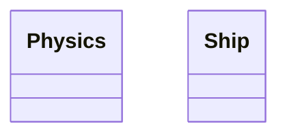
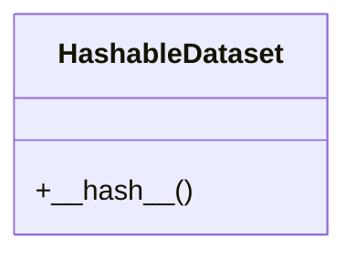
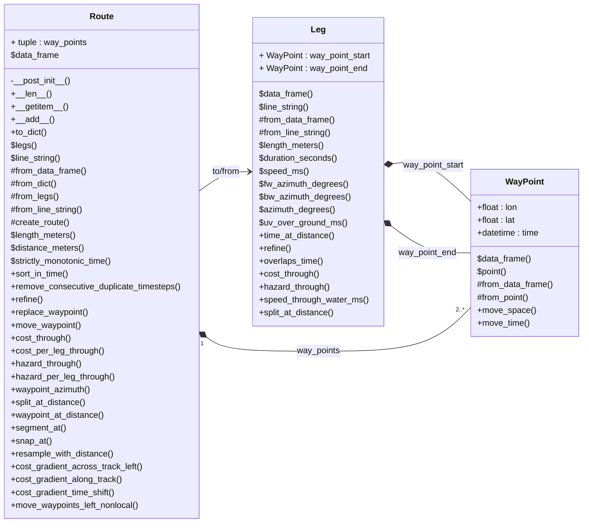

# Dev Notes

## `config.py`

```mermaid
classDiagram
    class Physics
    class Ship
```

## `hashable_dataset.py`

```mermaid
classDiagram
    class HashableDataset {
        +\_\_hash\_\_()
    }
```

## `routes.py`

```mermaid
classDiagram
    direction LR

    Leg *-- WayPoint : way_point_start
    Leg *-- WayPoint : way_point_end
    Route "1" *-- "2..*" WayPoint : way_points
    Route --> Leg : to/from

    class WayPoint{
        +float : lon
        +float : lat
        +datetime : time

        $data_frame()
        $point()
        #from_data_frame()
        #from_point()    
        +move_space()
        +move_time()
    }

    class Leg{
        + WayPoint : way_point_start
        + WayPoint : way_point_end

        $data_frame()
        $line_string()
        #from_data_frame()
        #from_line_string()

        $length_meters()
        $duration_seconds()
        $speed_ms()
        $fw_azimuth_degrees()
        $bw_azimuth_degrees()
        $azimuth_degrees()
        $uv_over_ground_ms()
        +time_at_distance()
        +refine()
        +overlaps_time()
        +cost_through()
        +hazard_through()
        +speed_through_water_ms()
        +split_at_distance()
    }

    class Route{
        + tuple : way_points
        
        -\_\_post_init\_\_()
        +\_\_len\_\_()
        +\_\_getitem\_\_()
        +\_\_add\_\_()
        
        $data_frame
        +to_dict()
        $legs()
        $line_string()

        #from_data_frame()
        #from_dict()
        #from_legs()
        #from_line_string()

        #create_route()
                
        $length_meters()
        $distance_meters()
        $strictly_monotonic_time()
        +sort_in_time()
        +remove_consecutive_duplicate_timesteps()
        +refine()
        +replace_waypoint()
        +move_waypoint()
        +cost_through()
        +cost_per_leg_through()
        +hazard_through()
        +hazard_per_leg_through()
        +waypoint_azimuth()
        +split_at_distance()
        +waypoint_at_distance()
        +segment_at()
        +snap_at()
        +resample_with_distance()
        +cost_gradient_across_track_left()
        +cost_gradient_along_track()
        +cost_gradient_time_shift()
        +move_waypoints_left_nonlocal()
    }
```